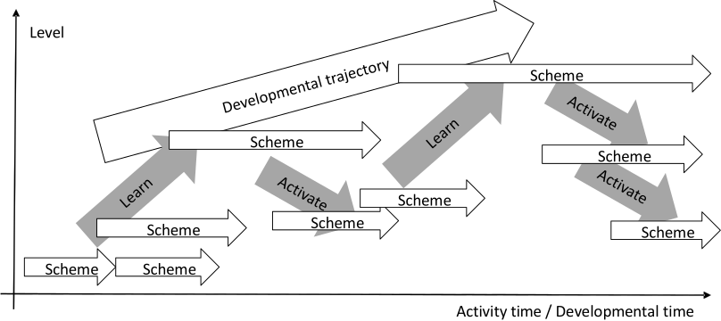
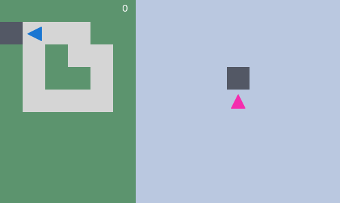
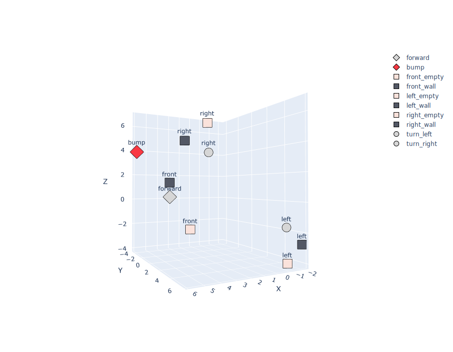
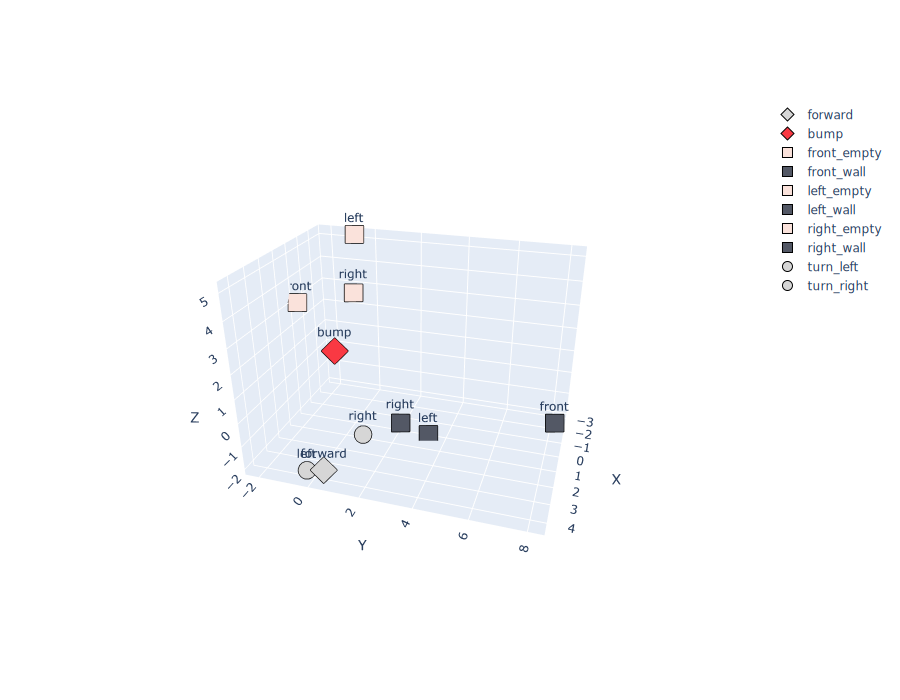

# Interactional Motivation in Schema Mechanism Tutorial

This repository offers self-guided tutorials on designing an autonomous artificial agent driven by interactional motivation and controlled by an enactive schema mechanism. 



_Figure 1: The developmental trajectory. The agent recursively creates and reiterates hierarchical behaviors based on initial interactional preferences._  


# Repository architecture

```
.
├── notebooks       # The jupyter notebooks.
└── README.md       # This file.
```

# 🔬 Tutorial

This totorial is designed to be followed in order. 

* [](https://colab.research.google.com/github/PetiteIA/schema_mechanism/blob/master/notebooks/agent1.ipynb) [Agent 1: the agent who avoided the ordinary](notebooks/agent1.ipynb)

* [](https://colab.research.google.com/github/PetiteIA/schema_mechanism/blob/master/notebooks/agent2.ipynb) [Agent 2: the agent who thrived on good vibes](notebooks/agent2.ipynb) 

* [](https://colab.research.google.com/github/PetiteIA/schema_mechanism/blob/master/notebooks/agent3.ipynb) [Agent 3: the agent who tamed the turtle](notebooks/agent3.ipynb)

* [](https://colab.research.google.com/github/PetiteIA/schema_mechanism/blob/master/notebooks/agent4.ipynb) [Agent 4: the agent who shifted with the context](notebooks/agent4.ipynb)

* [](https://colab.research.google.com/github/PetiteIA/schema_mechanism/blob/master/notebooks/agent5.ipynb) [Agent 5: the agent who changed his mind](notebooks/agent5.ipynb)

* [](https://colab.research.google.com/github/PetiteIA/schema_mechanism/blob/master/notebooks/agent6.ipynb) [Agent 6: the agent who followed ancient clues](notebooks/agent6.ipynb)

Not yet translated to english: 

* [](https://colab.research.google.com/github/PetiteIA/schema_mechanism/blob/master/notebooks/agent7.ipynb) [Agent 7: l'agent qui anticipait le coup suivant](notebooks/agent7.ipynb)

* [](https://colab.research.google.com/github/PetiteIA/schema_mechanism/blob/master/notebooks/agent8.ipynb) [Agent 8: l'agent qui respectait ses engagements](notebooks/agent8.ipynb)

* [](https://colab.research.google.com/github/PetiteIA/schema_mechanism/blob/master/notebooks/agent9.ipynb) [Agent 9: l'agent qui espérait gagner au coup suivant ](notebooks/agent9.ipynb)

* [](https://colab.research.google.com/github/PetiteIA/schema_mechanism/blob/master/notebooks/agent10.ipynb) [Agent 10: l'agent qui montait dans la hiérarchie](notebooks/agent10.ipynb)

* [](https://colab.research.google.com/github/PetiteIA/schema_mechanism/blob/master/notebooks/agent11.ipynb) [Agent 11: l'agent qui interagissait à distance](notebooks/agent11.ipynb)

* [](https://colab.research.google.com/github/PetiteIA/schema_mechanism/blob/master/notebooks/agent12.ipynb) [Agent 12: l'agent analysé](notebooks/agent11.ipynb)

* [](https://colab.research.google.com/github/PetiteIA/schema_mechanism/blob/master/notebooks/agent13.ipynb) [Agent 13: the agent who had long short term memory](notebooks/agent12.ipynb)

* [](https://colab.research.google.com/github/PetiteIA/schema_mechanism/blob/master/notebooks/agent14.ipynb) [Agent 14: l'agent qui simulait](notebooks/agent13.ipynb)

Experiments with Transformers (under development). 

* [](https://colab.research.google.com/github/PetiteIA/schema_mechanism/blob/master/NN/agent7-transformer_seq2seq.ipynb) [Experiment with Transformers](NN/agent7-transformer_seq2seq.ipynb)

# ▶️ Demonstration

The agent has 5 possible actions: `Move forward`, `turn left`, `turn right`, `feel right`,`feel front`, and `feel left`.
can only sense its environment through a binary feedback from its possible actions.  



_Video 1: Progressive learning of schemas: left: the agent in the environment. 
Right: the agent's internal simulator.
Flashing red squares indicate undesired interactions (bumping). 
Flashing Magenta triangles indicate prediction errors._


Video 1 shows the progressive schema learning by visualizing increasingly longer sequences of interactions (right) to adapt to the environment (left).
* The absence of flashing red squares after Step 64 indicates that the agent has learned to avoid bumping into walls by actively sensing its environment through the `feel front`, `feel left`, and `feel right` interactions and turning to the right direction.
* The absence of flashing magenta triangles after Step 502 indicates that the agent has learned to accurately predict the outcome of actions in this environment. 



_Figure 1: Projection of the embedding showing that the interactions have been grouped by their spatial positon (right, front, left)_



_Figure 2: Projection of the embedding showing that the interactions have been grouped by whether they represent a wall or an empty cell_

Figure 1 and Figure 2 show the projection of the embedding of the interactions in the agent's internal model.
The fact that they are grouped in a meaningful way indicates that the agent has learned to represent them in a way that is consistent with its experience interacting with the environment.
It is a form of experience-grounded semantics emergence.

# 📝 References

Georgeon O. & Ritter F. (2012). 
An intrinsically-motivated schema mechanism to model and simulate emergent cognition. 
Cognitive Systems Research 15-16: 73-92. 
[ScienceDirect](https://doi.org/10.1016/j.cogsys.2011.07.003). 
[PDF](doc/2012-CSR_Intrinsic_schema.pdf).

Georgeon O., Marshall J. & Gay S. (2012). 
Interactional motivation in artificial systems: Between extrinsic and intrinsic motivation. 
Second International Conference on Development and Learning and on Epigenetic Robotics (ICDL-EPIROB 2012), pp. 1-2.
[PDF](doc/2012-EPIROB_Interactional_Motivation.pdf).

Georgeon, O., Lurie, D., and Robertson, P. (2024). 
Artificial Enactive Inference in Three-Dimensional World. 
Cognitive Systems Research. 84: 101234. 
[ScienceDirect](https://doi.org/10.1016/j.cogsys.2024.101234).
[PDF](doc/2023-CSR_Enactive_Inference.pdf).

# 🎓 Learn more

* [Conférence UQAM 2025](https://youtu.be/lhuhBeAi1h0): Robotique développementale ancrée dans l'expérience moto-sensorielle.
* [Course 2024](https://eu01web.zoom.us/rec/play/EPmd-6POQz1Dz9M4Pi8IyBoC_A-EiBSNcfqSuvHixIVoONXL7f0RrAhg619A5XvMqUMaJrG0YyhKyiw4.xASIDuUxviA3xbzC?canPlayFromShare=true&from=share_recording_detail&continueMode=true&componentName=rec-play&originRequestUrl=https%3A%2F%2Feu01web.zoom.us%2Frec%2Fshare%2FkkmT0RHFoovctgea6JM74ZxNLvrzB0mY32alikbNC73YV7YJpDiQJcyXAVLf9Zq-.vY3o7QTS166adn6g): The recording of an introductory course at Reykjavik University via Zoom
* [Course 2014](https://www.youtube.com/playlist?list=PLlSPp5EpW5vEkajUvAG7r9HgDamIzZLUe): Recording of my course at Université Claude Bernard Lyon on youtube 
* [The PetitCat project](https://github.com/OlivierGeorgeon/osoyoo): applying interactional motivation to robotics

